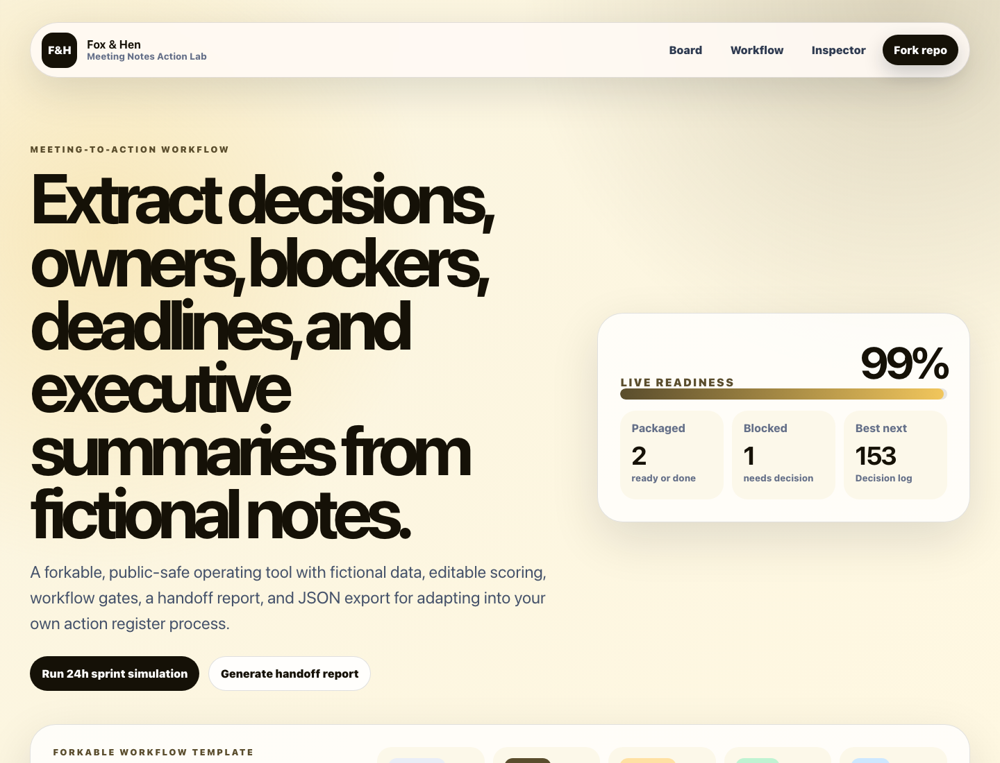

# Meeting Notes Action Lab

Public Fox & Hen working sample for a **meeting-to-action workflow**.



## Live Demo

- Demo: [https://foxhen-meeting-notes-action-lab.vercel.app](https://foxhen-meeting-notes-action-lab.vercel.app)
- Repository: [https://github.com/foxandhenllc/foxhen-meeting-notes-action-lab](https://github.com/foxandhenllc/foxhen-meeting-notes-action-lab)

## Purpose

Meeting notes action tracker for extracting decisions, owners, blockers, due dates, and follow-up summaries.

## What This Demo Is

Meeting Notes Action Lab is a forkable React/Vite operating tool for teams that want to extract decisions, owners, blockers, deadlines, and executive summaries from fictional meeting notes. It is intentionally small, static, and public-safe so you can copy the pattern without inheriting a backend or vendor lock-in.

## Fully Working Behaviors

- Search, filter, and sort a domain-specific workflow board.
- Add a fictional item and edit owner, notes, priority, value, effort, and friction.
- Advance status and watch readiness metrics update in real time.
- Run a 24-hour sprint simulation to reduce friction on the highest-scoring work.
- Toggle QA gates, generate a handoff report, and download the board as JSON.

## Workflow Template

See [docs/workflow-template.md](docs/workflow-template.md) for the sample notes-to-action register, adaptation checklist, and public-safe data rules.

## Suggested Forks

- Paste sanitized notes into item notes or import as cards.
- Score priority by executive urgency and value by decision impact.
- Use checks as follow-up completeness gates.
- Export JSON before sending the post-meeting action recap.

## SEO / AIO Discoverability

**Plain-language answer:** Use this repo to extract decisions, owners, blockers, due dates, and follow-up summaries from fictional meeting notes.

**Who it helps:** operators, project managers, consultants, and teams turning meetings into action plans.

**Search intents covered:**

- meeting notes action tracker
- extract action items from notes
- meeting follow up generator
- decision log template

**Why this repo is useful:** It keeps decisions, tasks, blockers, and follow-up copy visible before the next meeting is forgotten.

## Local Run

```bash
npm install
npm run dev
npm run build
```

## Public-Safe Scope

This is a static React/Vite demo with fictional sample data. It includes no production data, credentials, real contacts, copied customer work, backend, auth, or external service calls.
